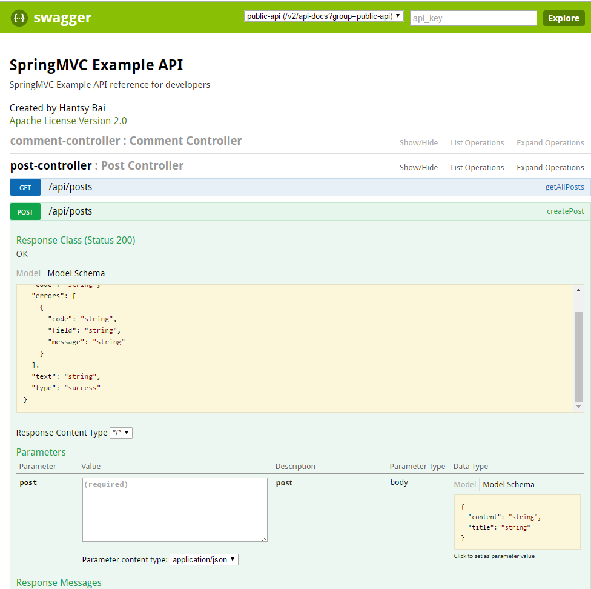
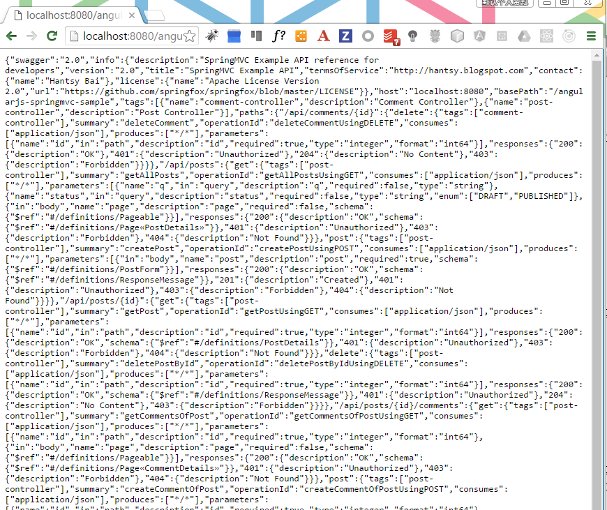
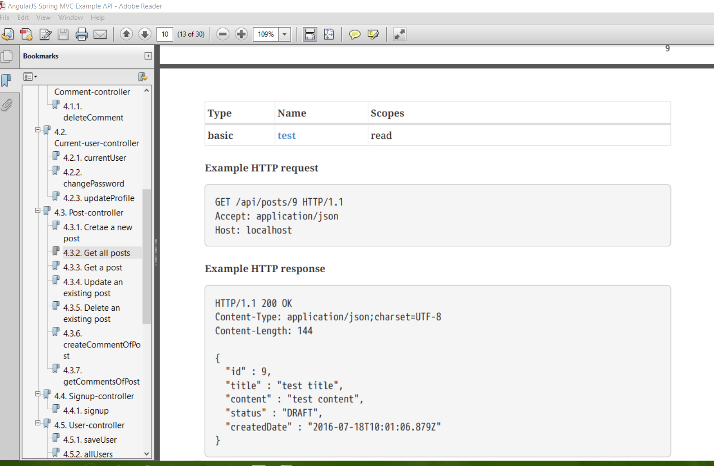

# Visualizes REST APIs with Swagger

Swagger is widely used for visualizing APIs, and with Swagger UI it provides online sandbox for frontend developers.

## Visualizes REST APIs

[SpringFox project](http://springfox.github.io/springfox/) provides Swagger support for Spring based REST APIs.

1. Add springfox to dependencies.

		<!-- SpringFox Swagger UI -->
		<dependency>
			<groupId>io.springfox</groupId>
			<artifactId>springfox-swagger2</artifactId>
			<version>${springfox.version}</version>
		</dependency>
			
		<dependency>
			<groupId>io.springfox</groupId>
			<artifactId>springfox-swagger-ui</artifactId>
			<version>${springfox.version}</version>
		</dependency>
		
	`springfox-swagger-ui` provides static Javascript UI for visualizing the Swagger schema definitions.
	
2. Add a `@Configuration` class to enable Swagger.

		@Configuration
		@EnableSwagger2
		public class SwaggerConfig {

			@Bean
			public Docket postsApi() {
				return new Docket(DocumentationType.SWAGGER_2)
						.groupName("public-api")
						.apiInfo(apiInfo())
						.select()
						.paths(postPaths())
						.build();
			}

			private Predicate<String> postPaths() {
				return or(
						regex("/api/posts.*"),
						regex("/api/comments.*")
				);
			}

			private ApiInfo apiInfo() {
				return new ApiInfoBuilder()
						.title("SpringMVC Example API")
						.description("SpringMVC Example API reference for developers")
						.termsOfServiceUrl("http://hantsy.blogspot.com")
						.contact("Hantsy Bai")
						.license("Apache License Version 2.0")
						.licenseUrl("https://github.com/springfox/springfox/blob/master/LICENSE")
						.version("2.0")
						.build();
			}

		}

	When the application starts up, it will scan all Controllers and generate Swagger schema definition at runtime, Swagger UI will read definitions and render user friendly UI for REST APIs.

3. View REST APIs in swagger ui.

	Starts up this application via command line.
	
		mvn tomcat7:run //or mvn spring-boot:run
		
	Open browser and navigate [http://localhost:8080/angularjs-springmvc-sample/swagger-ui.html](http://localhost:8080/angularjs-springmvc-sample/swagger-ui.html).	
	
	You will see the screen like the following.
	
	
	
## Documents REST APIs

In the above steps, the Swagger schema definition is generated at runtime, you can get the content via link:[http://localhost:8080/angularjs-springmvc-sample/v2/api-docs?group=public-api](http://localhost:8080/angularjs-springmvc-sample/v2/api-docs?group=public-api). You will see the complete Swagger schema definition.

You can save this page content as a json file and upload to [http://editor.swagger.io](http://editor.swagger.io) and edit it online.

The Swagger schema definition generation will consume lots of system resourcs at runtime. 

Combined with Springfox, [Swagger2Markup project](https://github.com/Swagger2Markup/swagger2marku), and [Spring RestDocs](http://projects.spring.io/spring-restdocs/), the Swagger schema definition can be converted to asciidocs, and with `asciidoctor-maven-plugin`, the asciidocs can be generated into static HTML5 or PDF files.

1. Add `swagger2-markup-maven-plugin` into *pom.xml* file. 

		<!-- First, use the swagger2markup plugin to generate asciidoc -->
		<plugin>
			<groupId>io.github.swagger2markup</groupId>
			<artifactId>swagger2markup-maven-plugin</artifactId>
			<version>${swagger2markup.version}</version>
			<dependencies>
				<dependency>
					<groupId>io.github.swagger2markup</groupId>
					<artifactId>swagger2markup-import-files-ext</artifactId>
					<version>${swagger2markup.version}</version>
				</dependency>
				<dependency>
					<groupId>io.github.swagger2markup</groupId>
					<artifactId>swagger2markup-spring-restdocs-ext</artifactId>
					<version>${swagger2markup.version}</version>
				</dependency>
			</dependencies>
			<configuration>
				<swaggerInput>${swagger.input}</swaggerInput>
				<outputDir>${generated.asciidoc.directory}</outputDir>
				<config>
					<swagger2markup.markupLanguage>ASCIIDOC</swagger2markup.markupLanguage>
					<swagger2markup.pathsGroupedBy>TAGS</swagger2markup.pathsGroupedBy>

					<swagger2markup.extensions.dynamicOverview.contentPath>${project.basedir}/src/docs/asciidoc/extensions/overview</swagger2markup.extensions.dynamicOverview.contentPath>
					<swagger2markup.extensions.dynamicDefinitions.contentPath>${project.basedir}/src/docs/asciidoc/extensions/definitions</swagger2markup.extensions.dynamicDefinitions.contentPath>
					<swagger2markup.extensions.dynamicPaths.contentPath>${project.basedir}/src/docs/asciidoc/extensions/paths</swagger2markup.extensions.dynamicPaths.contentPath>
					<swagger2markup.extensions.dynamicSecurity.contentPath>${project.basedir}src/docs/asciidoc/extensions/security/</swagger2markup.extensions.dynamicSecurity.contentPath>

					<swagger2markup.extensions.springRestDocs.snippetBaseUri>${swagger.snippetOutput.dir}</swagger2markup.extensions.springRestDocs.snippetBaseUri>
					<swagger2markup.extensions.springRestDocs.defaultSnippets>true</swagger2markup.extensions.springRestDocs.defaultSnippets>
				</config>
			</configuration>
			<executions>
				<execution>
					<phase>test</phase>
					<goals>
						<goal>convertSwagger2markup</goal>
					</goals>
				</execution>
			</executions>
		</plugin>
		
	The `convertSwagger2markup` goal will convert Swagger schema definition into asciidocs.	

2. Add `asciidoctor-maven-plugin` into `pom.xml` file.
		
		<!-- Run the generated asciidoc through Asciidoctor to generate
		other documentation types, such as PDFs or HTML5 -->
		<plugin>
			<groupId>org.asciidoctor</groupId>
			<artifactId>asciidoctor-maven-plugin</artifactId>
			<version>1.5.3</version>
			<!-- Include Asciidoctor PDF for pdf generation -->
			<dependencies>
				<dependency>
					<groupId>org.jruby</groupId>
					<artifactId>jruby-complete</artifactId>
					<version>${jruby.version}</version>
				</dependency>
				<dependency>
					<groupId>org.asciidoctor</groupId>
					<artifactId>asciidoctorj-pdf</artifactId>
					<version>${asciidoctorj-pdf.version}</version>
				</dependency>
			</dependencies>
			<!-- Configure generic document generation settings -->
			<configuration>
				<sourceDirectory>${asciidoctor.input.directory}</sourceDirectory>
				<sourceDocumentName>index.adoc</sourceDocumentName>
				
				<sourceHighlighter>coderay</sourceHighlighter>
				<attributes>
					<doctype>book</doctype>
					<toc>left</toc>
					<toclevels>3</toclevels>
					<numbered></numbered>
					<hardbreaks></hardbreaks>
					<sectlinks></sectlinks>
					<sectanchors></sectanchors>
					<generated>${generated.asciidoc.directory}</generated>
				</attributes>
			</configuration>
			<!-- Since each execution can only handle one backend, run
			separate executions for each desired output type -->
			<executions>
				<execution>
					<id>output-html</id>
					<phase>test</phase>
					<goals>
						<goal>process-asciidoc</goal>
					</goals>
					<configuration>
						<backend>html5</backend>
						<outputDirectory>${asciidoctor.html.output.directory}</outputDirectory>
					</configuration>
				</execution>
				
				<execution>
					<id>output-pdf</id>
					<phase>test</phase>
					<goals>
						<goal>process-asciidoc</goal>
					</goals>
					<configuration>
						<backend>pdf</backend>
						<outputDirectory>${asciidoctor.pdf.output.directory}</outputDirectory>
					</configuration>
				</execution>              
			</executions>
		</plugin>	
		
	`asciidoctor-maven-plugin` will generate the asciidocs into HTML5 and PDF files.

3. Add `spring-restdocs` support.

	`spring-restdocs` will generate the sample code snippets from test, which can be combined into the final docs.
	
	Add related dependencies into `pom.xml` file.
	
	    <dependency>
            <groupId>io.github.swagger2markup</groupId>
            <artifactId>swagger2markup-spring-restdocs-ext</artifactId> 
            <version>${swagger2markup.version}</version>
            <scope>test</scope>
        </dependency>

        <dependency>
            <groupId>org.springframework.restdocs</groupId>
            <artifactId>spring-restdocs-mockmvc</artifactId>
            <scope>test</scope>
        </dependency>
	
	Write test codes to generate sample code snippets.
	
		@WebAppConfiguration
		@RunWith(SpringRunner.class)
		@SpringBootTest(classes = {Application.class, SwaggerConfig.class})
		public class MockMvcApplicationTest {

			String outputDir = System.getProperty("io.springfox.staticdocs.outputDir");
			String snippetsDir = System.getProperty("io.springfox.staticdocs.snippetsOutputDir");
			String asciidocOutputDir = System.getProperty("generated.asciidoc.directory");

			@Rule
			public final JUnitRestDocumentation restDocumentation = new JUnitRestDocumentation(System.getProperty("io.springfox.staticdocs.snippetsOutputDir"));

			@Inject
			private WebApplicationContext context;

			@Inject
			private ObjectMapper objectMapper;

			@Inject
			private PostRepository postRepository;

			private MockMvc mockMvc;

			private Post savedIdentity;

			@Before
			public void setUp() {
				this.mockMvc = webAppContextSetup(this.context)
						.apply(documentationConfiguration(this.restDocumentation))
						.alwaysDo(document("{method-name}",
								preprocessRequest(prettyPrint()),
								preprocessResponse(prettyPrint())))
						.build();

				savedIdentity = postRepository.save(newEntity());
			}

			@Test
			public void createSpringfoxSwaggerJson() throws Exception {
				//String designFirstSwaggerLocation = Swagger2MarkupTest.class.getResource("/swagger.yaml").getPath();

				MvcResult mvcResult = this.mockMvc.perform(get("/v2/api-docs")
						.accept(MediaType.APPLICATION_JSON))
						.andDo(
								SwaggerResultHandler.outputDirectory(outputDir)
								.build()
						)
						.andExpect(status().isOk())
						.andReturn();

				//String springfoxSwaggerJson = mvcResult.getResponse().getContentAsString();
				//SwaggerAssertions.assertThat(Swagger20Parser.parse(springfoxSwaggerJson)).isEqualTo(designFirstSwaggerLocation);
			}

			//    @Test
			//    public void convertToAsciiDoc() throws Exception {
			//        this.mockMvc.perform(get("/v2/api-docs")
			//                .accept(MediaType.APPLICATION_JSON))
			//                .andDo(
			//                        Swagger2MarkupResultHandler.outputDirectory("src/docs/asciidoc")
			//                        .withExamples(snippetsDir).build())
			//                .andExpect(status().isOk());
			//    }
		
			@Test
			public void getAllPosts() throws Exception {
				this.mockMvc
						.perform(
								get("/api/posts/{id}", savedIdentity.getId())
								.accept(MediaType.APPLICATION_JSON)
						)
						//.andDo(document("get_a_post", preprocessResponse(prettyPrint())))
						.andExpect(status().isOk());
			}

			@Test
			public void getAllIdentities() throws Exception {
				this.mockMvc
						.perform(
								get("/api/posts")
								.accept(MediaType.ALL)
						)
						//.andDo(document("get_all_posts"))
						.andExpect(status().isOk());
			}

			@Test
			public void createPost() throws Exception {
				this.mockMvc
						.perform(
								post("/api/posts")
								.contentType(MediaType.APPLICATION_JSON)
								.content(newEntityAsJson())
						)
						//.andDo(document("create_a_new_post"))
						.andExpect(status().isCreated());
			}

			@Test
			public void updatePost() throws Exception {
				this.mockMvc
						.perform(
								put("/api/posts/{id}", savedIdentity.getId())
								.contentType(MediaType.APPLICATION_JSON)
								.content(newEntityAsJson())
						)
						//.andDo(document("update_an_existing_post"))
						.andExpect(status().isNoContent());
			}

			@Test
			public void deletePost() throws Exception {
				this.mockMvc
						.perform(
								delete("/api/posts/{id}", savedIdentity.getId())
								.contentType(MediaType.APPLICATION_JSON)
						)
						//.andDo(document("delete_an_existing_post"))
						.andExpect(status().isNoContent());
			}

			private Post newEntity() {
				Post post = new Post();
				post.setTitle("test title");
				post.setContent("test content");

				return post;
			}

			private String newEntityAsJson() throws JsonProcessingException {
				return objectMapper.writeValueAsString(newEntity());
			}

		}

4. Run `mvn clean verify` to execute all tests and generate HTML5 and PDF file for the REST APIs.

	Open *\target\asciidoc\html\index.html* in browser, it looks like.
	
	
	
	Open *\target\asciidoc\pdf\index.pdf* in Pdf viewer, it looks like.
	
	
	

## Source Code

Check out sample codes from my github account.

	git clone https://github.com/hantsy/angularjs-springmvc-sample
	
Or the Spring Boot version:

	git clone https://github.com/hantsy/angularjs-springmvc-sample-boot
	
Read the live version of theses posts from Gitbook:[Building RESTful APIs with Spring MVC](https://www.gitbook.com/book/hantsy/build-a-restful-app-with-spring-mvc-and-angularjs/details).

